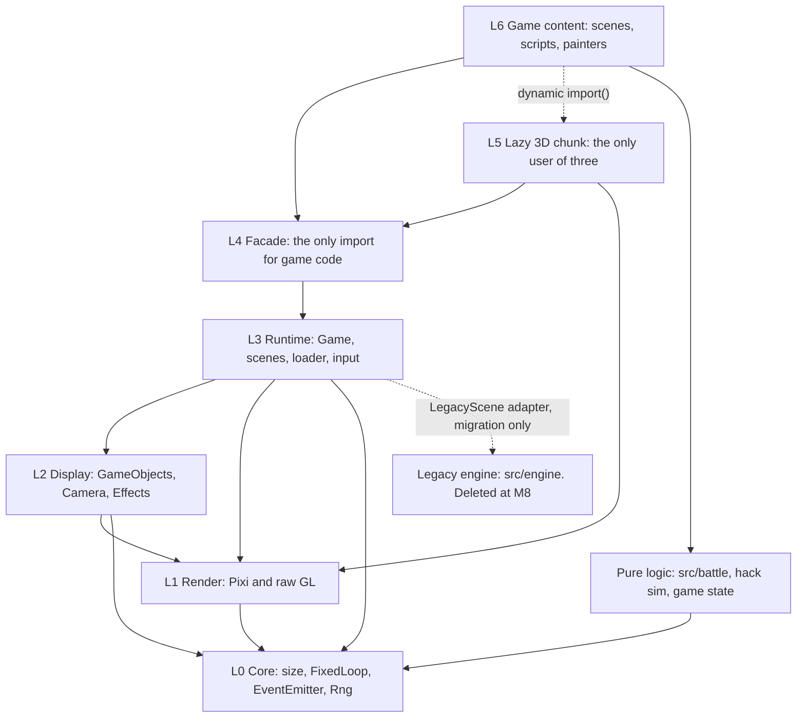
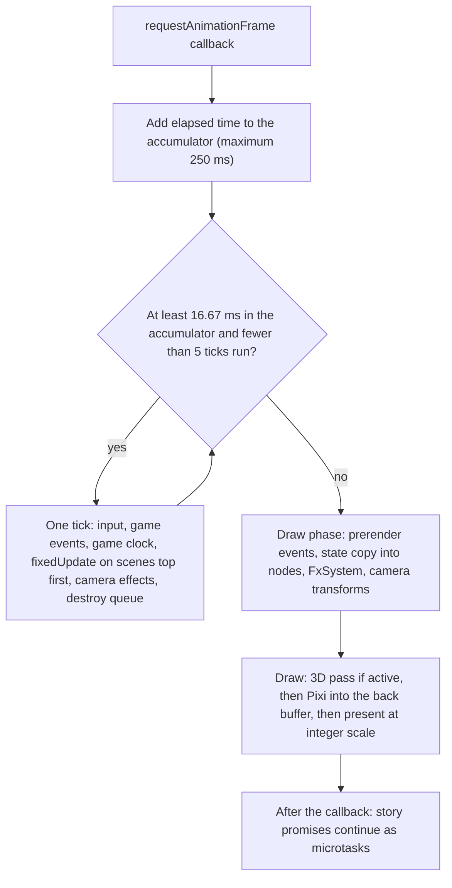
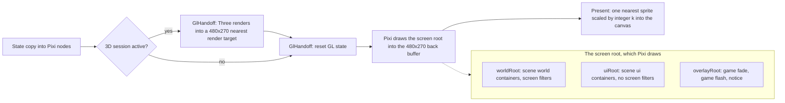

# Shadow Jog Engine — Overview

This is the 10-minute version. It tells you what the engine is, what its parts are, and where each part comes from. No engine code exists yet. Nothing is built until you approve this design (decision 17 in `docs/PHASE-0.2.md`).

> **Decisions for Mark.** The full list of 25 is in [decisions.md](decisions.md). These seven matter most.
>
> | # | Question | Recommendation |
> |---|---|---|
> | E1 | How is behaviour written? | Phaser style: scene code and small object subclasses. No ECS. No Unity components. |
> | E2 | What is the name of the 60 Hz hook? | `fixedUpdate(tick)`. Phaser's variable-delta `update` is not provided. |
> | E3 | How does the 3D picture reach Pixi? | One shared WebGL2 context. Three draws into a render target. Pixi shows it as a sprite. A canvas copy is the fallback. |
> | E4 | Where do the whole-screen effects live? | One filter that ports today's presenter shader. Per-object effects are separate. |
> | E5 | What happens with no WebGL2? | Show a clear message from M6. Keep the Canvas 2D engine only before M6. |
> | E6 | When does Pixi load? | Lazy, behind a small shell. Set the bundle caps after M1 and M2 measurements. |
> | E22 | Which deviations from Phaser do we accept? | Accept the list of sixteen. Each one is tagged and explained. |
>
> **How to answer.** Reply with the number and the letter, for example "E3 B". Reply "all recommendations" to accept every recommendation. Two more need your eyes: the look of filters at game resolution (E8) and the 640x360 follow-up (E12).
>
> **IDs.** E = open engine decision. M = build milestone. T = test tier. Level 0 to 6 = code level.

---

## 1. What the engine is and is not

PixiJS v8 draws all the 2D. Three.js draws the 3D mode only. The engine is the code between your game and those two libraries.

**The engine is** a thin layer, about 6 to 8 thousand lines (estimate, low confidence), over a bare Pixi v8 `WebGLRenderer`. It gives the game a scene stack, a scene graph, a camera, a texture store, input actions, timers, and a render pipeline. It follows Phaser 4 names and rules.

**The engine is not:**

- An editor. It has no scene files and no inspector UI beyond the dev tools in [tooling-and-testing.md](tooling-and-testing.md).
- A physics engine. The game has none.
- A copy of all of Phaser. We build a class only when a ported scene needs it.
- A replacement for the battle rules, the saves, the story scripts, the WebAudio synth, or Mark's data in `src/data/*.json`. These stay.

**Pixi is only the renderer.** Game code never imports `pixi.js`. A `GameObject` owns one Pixi node. The wrapper hides the differences between Phaser and Pixi.

## 2. Three things that look like Phaser and are not

> **Three things that look like Phaser and are not.** (1) `fixedUpdate(tick)` runs at a fixed 60 Hz. There is no variable-delta `update`. (2) `game.run(scene)` waits for `close(result)`. (3) Pixi has no camera. The engine builds one.

Four more words mean different things in different engines. This table says which meaning wins here. Other collisions (stage, tick and frame, tier, view) are in [conventions.md](conventions.md) section 2.

| Word | Other meanings | Meaning in Shadow Jog |
|---|---|---|
| Scene | Godot: a reusable node tree. Unity: a level file. Three.js: the root `Object3D`. | A whole screen state on the stack, as in Phaser. Write "Three Scene" for the Three.js one. |
| run | Phaser `ScenePlugin.run`: queue a scene, no wait. | `game.run(scene)` pushes a scene and returns a promise. |
| Layer | Phaser `Layer`: a display list. Godot `CanvasLayer`. Pixi `RenderLayer`. Unity Sorting Layer. | We have no `Layer` class. `scene.add.layer()` returns a `Container` kept at identity. Pixi `RenderLayer` is internal only. |
| Timeline | Unity Timeline: a data asset. | Phaser's `scene.add.timeline([...])`: a list of timed steps. |

## 3. Reading order

1. This file.
2. [scene-graph.md](scene-graph.md): what the tree is made of.
3. [frame-and-rendering.md](frame-and-rendering.md): the loop, the render pipeline, the 3D mode.
4. [interfaces.md](interfaces.md): the key TypeScript interfaces.
5. [conventions.md](conventions.md): which engine each name comes from.
6. [tooling-and-testing.md](tooling-and-testing.md): dev tools, tests, CI, agent docs.
7. [migration.md](migration.md): the path from today's engine and from the Phaser spike.
8. [decisions.md](decisions.md): every open decision.

Source material: `docs/research/2026-10-04-engine-and-3d.md`, decision 17 in `docs/PHASE-0.2.md`, today's engine in `src/engine/` (about 2,900 lines), the Phaser reference on branch `spike/phaser-stage` (folder `src/stage`), and editor behaviour in `docs/TOOLING-UI.md`.

## 4. Code levels

Dependencies point down only. A Biome rule and a Vitest import scan enforce this. `sje` means Shadow Jog Engine. The new code lives in `src/sje/`. The old `src/engine/` stays until M8, so the shipped game still works.

| Level | Folder | Holds | May import |
|---|---|---|---|
| 0 | `src/sje/core/` | `size.ts`, `FixedLoop`, `EventEmitter`, `Rng`, `assert`. No Pixi, no DOM. | nothing |
| 1 | `src/sje/render/` | `GlContext`, `PixiRenderer`, `BackBuffer`, `Presenter`, `GlHandoff`. The only code that touches the renderer and raw GL. | level 0 |
| 2 | `src/sje/display/` | `GameObject`s, `Camera`, `TextureManager`, Effects. The only code with Pixi scene classes. | levels 0 and 1 |
| 3 | `src/sje/runtime/` | `Game`, `SceneManager`, `Scene`, `Loader`, `Input`, the audio bridge. | levels 0 to 2 |
| 4 | `src/sje/index.ts` | The facade. The only import for game code. | level 3 |
| 5 | `src/sje/three/`, `src/hack3d/` | The lazy 3D chunk: `View3D` internals, `Scene3D`, `HackScene`. The only code that imports `three`. | levels 4 and 1 |
| 6 | `src/scenes/`, `src/game/`, `src/field/`, and similar | Game content: scenes, story scripts, field kit, painters, Mark's JSON. | level 4, and level 5 by `import()` |

## 5. Core primitives

The "Follows" column says which engine the concept comes from. `(ours)` means no engine has the concept, or we changed it on purpose. The "Built" column says when: M1 is the first milestone that needs it, "on demand" means we build it when a ported scene needs it.

| Primitive | What it is | Follows | Built |
|---|---|---|---|
| `Game` | Owns the context, renderer, loop, managers, global events. Created with `await Game.create()`. | Phaser `Game` | M1 |
| `FixedLoop` | Fixed 60 Hz step with a 250 ms clamp and at most 5 catch-up ticks. | Gaffer accumulator, Unity `FixedUpdate`, Godot `_physics_process` | M1 |
| `SceneManager`, `Scene` | A stack of screen states. Each owns its display list, cameras, input, loader, clock, tweens, events. | Phaser | M1 |
| `game.run` | Push a scene. Resolve a promise on `close(result)`. | Godot `await`, Unity `Awaitable` (ours as a whole) | M1 |
| `GameObject` | The unit of the display list. Wraps one Pixi node. | Phaser | M1 |
| `Container`, `Group`, `scene.add.layer()` | Nest and mask children. A pool. A factory for a transform-less list (not a class). | Phaser | `Container` M1, `Group` on demand |
| `ImageObject`, `Sprite`, `Graphics`, `TextObject`, `Zone` | The leaf types. | Phaser | M1 (`Zone` M3) |
| `Camera` | Scroll, zoom, bounds, follow, fade, flash, shake. A transform on the scene's `world` container. | Phaser | M1 |
| `depth` and bands | A number per object. Named bands for the ranges. | Phaser `depth`, Unity Sorting Layer | M1 |
| `filters`, `mask` | Per-object and per-camera GPU effects. | Phaser 4 and Pixi (flat list, a deviation) | M2 |
| `Effect`, `createEffect` | A per-object effect that you build from your own GLSL. | ours | M2 |
| `FxSystem` | Screen effects and particles. Keeps today's `postfx` names and signatures. | ours (keeps today's API) | M2 |
| Scene services: `time`, `tweens`, `events`, `lights` | Clock and timers, tweens, event emitter, light map. All scene-owned. | Phaser | `events` M1, others on demand |
| `TextureManager` | Name-keyed texture store. Accepts generated canvases. | Phaser | M1 |
| `Loader` | Loads PNG and JSON by key. Falls back to code-drawn art. | Phaser, Unity Addressables (bundles) | M1 |
| `ActionMap` | The nine named input actions. | Godot `InputMap`, Unity action maps | M1 |
| `Rng`, `visualRng` | Seeded random streams. Gameplay and visual randomness stay apart. | ours (today's code) | M1 |
| `Display` | Integer scale in device pixels. Pointer mapping. | Unity Pixel Perfect Camera, Godot integer stretch | M1 |
| `size.ts` | The one source of `W` and `H`. | Godot base resolution | M0 |
| `GlHandoff` | The one module that switches between Three, Pixi, and raw GL. | ours | M1b |
| `View3D`, `Frame3D`, `Scene3D` | The 3D mode seen from the 2D side. | Three.js names inside, ours outside | M1b and M7 |

Full tables with Unity, Godot, and Three.js names are in [conventions.md](conventions.md).

## 6. The frame in one diagram

<!-- keep in sync with frame-and-rendering.md section 1 -->

The tick changes game state. The draw phase only reads it. Details are in [frame-and-rendering.md](frame-and-rendering.md).

## 7. The render pipeline in one diagram

All filters run at game resolution (480x270). This keeps every game pixel an exact block after the integer upscale. The price is a chunkier blur and glow. This is a look decision for you (E8).

## 8. The 3D mode in short

The 3D mode is a `Scene3D` subclass in a lazy chunk. A story script starts it with `await s.hack(def)`.

1. The engine shares one WebGL2 context between Pixi and Three.
2. Three loads on the first entry.
3. Three draws into a 480x270 render target with nearest filtering.
4. Pixi shows that target as a normal sprite called `View3D`. Filters, masks, blend modes, and tweens work on it.

`s.hack` always returns a value: `success`, `fail`, `aborted`, or `unsupported`. A watchdog ends the scene if the GL context is lost. A canvas-copy path with a second context is the fallback, behind the same `Frame3D` interface. Details are in [frame-and-rendering.md](frame-and-rendering.md) section 7.

## 9. What is proven and what is not

The key claims passed agent labs on 2026-10-04 (headless Chromium on software WebGL). They are not tested inside the real engine, on Chromium 153, in Safari or WebKit, or for the look of the field and the lighting. The lab evidence is in `docs/research/2026-10-04-engine-labs.md`. The Phase 0 lab in [migration.md](migration.md) closes these gaps before M1 starts.
