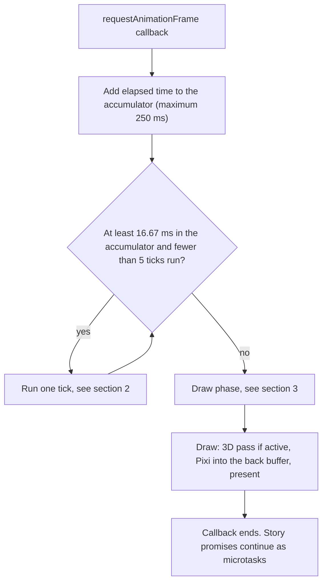
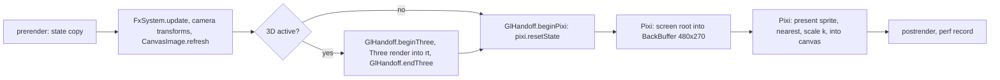
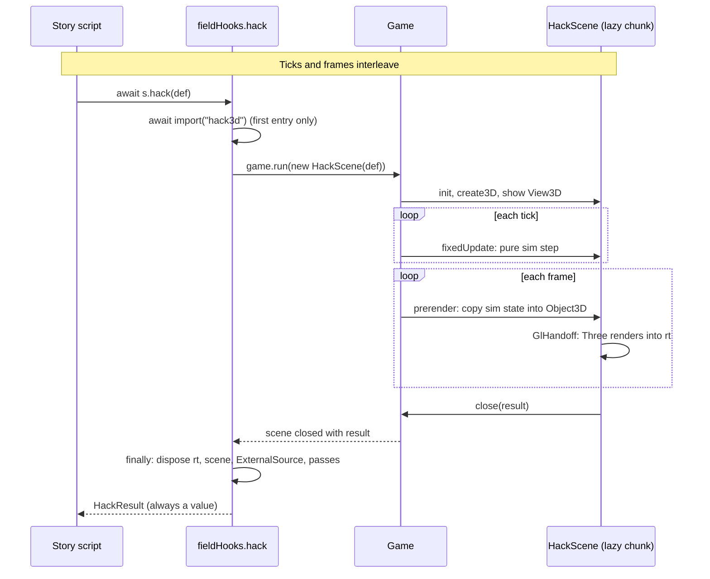

# Shadow Jog Engine — Frame and rendering

This file covers time and drawing. It describes the loop, the order of work in one tick, timers and tweens, the render pipeline, the 3D integration, and determinism.

> **Read first:** [Three things that look like Phaser and are not](README.md#2-three-things-that-look-like-phaser-and-are-not). Tag meanings are in the "Tags" table at the top of [conventions.md](conventions.md).

**Evidence labels.** "Lab" means an agent experiment on 2026-10-04 in headless Chromium 151 on SwiftShader (software WebGL), mostly at device pixel ratio 1. The lab evidence is in `docs/research/2026-10-04-engine-labs.md`. The lab scripts are in the git-ignored `media/research-2026-10-04/` on Mark's machine. M0 copies the scripts that matter into the repo as the canary tests. "Not tested" means no experiment exists. "Source-read" means someone read the installed package source but did not run it. Every lab number is an estimate for planning.

**Lab record.** `docs/research/2026-10-04-engine-labs.md` lists the load-bearing claims of each research leg, with their evidence paths and every claim that the fact-checker corrected or could not verify. The numbers come from one session on one machine. The Phase 0 lab re-runs the ones that matter.

---

## 1. The loop

The engine owns the only loop that runs game code. It uses one `requestAnimationFrame` callback. It has no Pixi `Application`, no `Ticker.shared` loop, and no `setAnimationLoop`. The loop is today's loop from `src/main.ts`, moved into `FixedLoop`.

1. Add `min(250 ms, elapsed)` to an accumulator.
2. While the accumulator holds at least 1000/60 ms and fewer than 5 ticks ran, run one tick (`game.speed` ticks per step). If the fifth tick ran, drop the backlog.
3. Run the draw phase once.
4. Record performance data.

**Hidden tab.** `requestAnimationFrame` stops. The 250 ms clamp prevents a burst of catch-up ticks when the tab returns.

**Pixi starts a second loop by itself.** In Pixi 8.22 the renderer has a `SchedulerSystem`. Its `init()` calls `Ticker.system.add(...)`, and `Ticker.system` has `autoStart = true`. So `renderer.init()` always starts a second `requestAnimationFrame` loop, even without `pixi.js/events`. The same loop runs Pixi's GC schedule. A test against the installed package confirmed this (a `SchedulerSystem.init()` call with `requestAnimationFrame` stubbed).

1. Call `Ticker.system.stop()` right after `renderer.init()`. This also halts Pixi's GC schedule. The engine unloads textures itself (section 6.1, item 6), so this is intended. This step is **not tested** in a running engine. A canary test must check that no Pixi `requestAnimationFrame` callback runs after boot.
2. Set `Ticker.shared.autoStart = false` and stop it. Pixi's `AnimatedSprite`, `GifSprite`, and `VideoSource` start a wall-clock loop on it. The engine does not use them.
3. The `pixi.js/events` module also registers on `Ticker.system`. It loads in dev and editor builds only. Those builds run Pixi's callbacks, so the rAF-interval gate and `__SJ__.step` must ignore them.
4. Do not import `pixi.js/accessibility`. Its Tab handler would clash with the game's menu key.

<!-- keep in sync with README.md section 6 -->



---

## 2. One tick

The order is the order of `Game.tick` today, with Phaser event names added.

1. `input.update()`: keyboard, gamepad, and touch edge state.
2. `game.events` emits `prestep(tick)`, then `step(tick)`.
3. Legacy tickers run. During the migration, `postfx.update` is one.
4. The game clock advances: `tick++`, `playFrames`, due `game.wait()` timers resolve, fades advance, shake and flash counters advance.
5. For each scene, top first, while the scene status is `running`:
   1. `sys.events` emits `preupdate`.
   2. The scene's `time` (clock) and `tweens` advance. Then the timelines advance.
   3. `scene.fixedUpdate(tick)` runs.
   4. `sys.events` emits `update`, then `postupdate`. Camera effects advance. Dirty flags flush.
6. `game.events` emits `poststep(tick)`. `input.endFrame()` runs.
7. Fault counting runs per game, as today (`faultedThisTick`). One counter covers the whole tick. After `FAULT_LIMIT` (30) ticks in a row that throw, `onFault` runs, the game abandons, and it returns to the title with a notice. A separate counter covers the draw phase (section 3).
8. The destroy queue runs. Destroyed objects end their timers, tweens, and event connections here.

Scene operations (`launch`, `pause`, `stop`, and the rest) are queued and applied at the next tick. This is Phaser's rule.

**Paused scenes.** A scene below the top is paused unless every scene above it has `passUpdate = true`. A paused scene is skipped in step 5.

**Hitstop** is "do not call the world tick for n ticks". The spike does it this way. `Clock.timeScale` is supported for slow motion.

### Scene lifecycle

Phaser's lifecycle is `init(data)`, `preload()`, `create(data)`, `update`. Ours keeps the first three. Phaser's `preload` is asynchronous. The story contract needs `game.run` to push the scene at once. This is the rule that joins them:

1. `game.run(scene)` pushes the scene on the stack **synchronously**. It calls `init(data)` and `preload()` at once. It also runs `input.consume()`, as today.
2. If `preload()` adds nothing to the loader, or all keys are in the cache, `create(data)` runs at once in the same call.
3. Otherwise the scene status is `loading`. `fixedUpdate` does not run. `create(data)` runs when the loader completes. A load error uses the stand-in path and a notice. It does not reject.
4. The promise from `game.run` resolves on `close(result)`. It does not depend on when `create` ran.
5. A lazy chunk loads **before** the scene is built. Example: `s.hack(def)` does `await import(...)`, then `game.run(new HackScene(def))`.

Shutdown and destroy are events, not methods, as in Phaser: `sys.events.emit('shutdown')`.

**Scene status.** The names are the lowercase values of the `SceneStatus` type in [interfaces.md](interfaces.md).

| Status | Meaning | `fixedUpdate` runs? |
|---|---|---|
| `init` | The scene object exists. `init(data)` runs. | No |
| `start` | The scene is on the stack. `preload()` runs. | No |
| `loading` | The loader is busy. | No |
| `creating` | `create(data)` runs. | No |
| `running` | The scene is live. | Yes |
| `paused` | Below the top, and no scene above passes updates. | No |
| `sleeping` | Not updated and not drawn. | No |
| `shutdown` | The scene is leaving. Timers and tweens stop. | No |
| `destroyed` | All objects are freed. | No |

---

## 3. The draw phase

The draw phase reads simulation state. It never changes it. It has no effect on determinism.

1. `game.events` emits `prerender(alpha)`. `alpha` is the leftover accumulator fraction. Default scenes ignore it. Nothing interpolates in v1. Motion snaps to whole pixels and repeats frames on a 120 Hz or 144 Hz screen, as today's engine does. If you see judder on a fast monitor, E2 is the place to change it.
2. Per scene, bottom first, `sys.events` emits `prerender`. State copy: the handlers copy simulation state into nodes. Positions are rounded, textures are swapped, filters are updated.
3. `FxSystem.update`, camera transforms, and `CanvasImage.refresh()` for dirty canvases run.
4. If a 3D session is active, the GlHandoff sequence runs (section 7).
5. `pixi.resetState()`. Pixi draws the screen root into the back buffer. The presenter draws the back buffer at integer scale (section 6).
6. `game.events` emits `postrender`. The perf recorder runs. The GPU-slow watchdog runs.
7. A throw in any `prerender` handler or in the Pixi draw counts as a render fault. Today's `Game` has a separate `renderFaults` counter for this. The new `Game` keeps it, with the same limit of 30. The M1 gate ports the two render-fault cases of `tests/game.test.ts`.

`prerender` is the only place where code may write to Pixi nodes. A Vitest test and a lint rule forbid state writes in `prerender` handlers (E2).

**Microtasks.** Promise continuations (story `await s.say(...)`) run after the whole callback. They do not run between ticks. This is today's behaviour. It follows from JavaScript rules and the shape of the loop. A test covers it in the M1 gate.

---

## 4. Time, timers, tweens, timelines

### Units

- Everything advances by **ticks**.
- Phaser APIs take **milliseconds**. `scene.time.delayedCall(500, fn)` converts to `max(1, round(500 / TICK_MS))` ticks. The result is deterministic.
- `game.wait(frames)` stays as it is. One frame equals one tick. About 25 call sites and all story scripts use it.
- `game.waitMs(ms)` `(ours)` is new.
- The two units sit side by side by design. E10 asks if you want one unit.

### The Phaser names we keep

| Call | Follows | Built |
|---|---|---|
| `scene.time.delayedCall(ms, fn)` | Phaser `Clock` | on demand |
| `scene.time.addEvent({ delay, loop, repeat, callback })` | Phaser `Clock` | on demand |
| `scene.time.timeScale` | Phaser `Clock` | M1 |
| `scene.tweens.add({ targets, ..., duration, ease })` | Phaser `TweenManager` | on demand |
| `scene.tweens.chain`, `addCounter` | Phaser | on demand |
| `scene.add.timeline([{ at, run }, ...])` | Phaser `Timeline` | on demand |

Easing names are Phaser's (`Sine.easeInOut`, `Cubic.easeOut`). The inline easing maths in `field.ts` and `battlekit/banner.ts` moves to tweens when those scenes port, not before.

The spike used no tweens, no timelines, and no Phaser timers. So none of them blocks M1 to M3.

### Lifetime: everything dies with its owner

All timed work belongs to a scene: clock events, tweens, timelines, and event connections. When the scene shuts down:

- Clock events and tweens stop. Their callbacks do not run.
- Event connections made with the scene (or an object of the scene) as `context` end.
- Engine-owned awaits reject with `Cancelled`. These are `scene.time.wait(ms)` `(ours)` and `tween.finished` `(ours)`. `src/main.ts` already has an `unhandledrejection` handler that calls `reportError`. A second listener would not stop it. So the engine extends that handler (or its replacement). The handler returns early when `e.reason instanceof Cancelled`, and it calls `e.preventDefault()`. A test must show that a cancelled `scene.time.wait` shows no notice. Code that cares writes `.catch(ignoreCancel)`.
- `scene.signal` is an `AbortSignal` that aborts at shutdown. Use it for `fetch` and for your own awaits.

### Awaiting a scene

A pending `game.run()` promise resolves only through `close(result)`. If the scene ends any other way (`abandon`, `reset`, fault recovery), the promise stays pending forever, as today. The story flow stops dead. This is intended: it is what `abandon()` means.

The 3D mode is the exception. `s.hack(def)` always resolves, with `aborted` when needed (section 7). E11 records the two cancel rules for your review.

### Audio timing

The WebAudio sequencer stays on `setInterval(25 ms)` plus `AudioContext` time. It is not part of the tick.

---

## 5. The shared W/H module

One module, `src/sje/core/size.ts`, owns the logical resolution.

```ts
export const W = 480, H = 270, FPS = 60;
export const TICK_MS = 1000 / FPS;
export const grain = (n: 1 | 2 | 4) => ({ w: W / n, h: H / n });
```

- Every renderer, `Display`, the presenter, the editors, and every mixed-grain layer import it. No other code may use a number that means the screen width, height, or centre.
- A plain text search for `480`, `270`, `240`, and `135` is too noisy. A grep on 2026-10-04 found 22 hits outside `src/engine`, `src/dev`, and `main.ts`. Many do not mean resolution. Examples: `price: 480` in `src/data/items.ts`, colour values such as `rgba(63,224,240,0.08)`, and column positions of 240 in `ui/menu.ts` that equal W/2 by accident.
- So the Vitest scan looks only for uses that mean screen width, height, or centre. It ignores strings and data files. It has a per-file allow-list, and each entry has a reason. Battle grain maths (240x135 in `battle/fx.ts`) uses `grain()`.
- M0 replaces only the cases that mean screen width, height, or centre. It does not touch layout numbers that equal W/2 by accident. The `postfx.ts` centre defaults (`x = 240`, `y = 135`) change at M2, when `FxSystem` takes over.
- 34 files import `W` and `H` from `engine/game.ts` today. M0 moves the imports. This is the only change to the shipped path before the flag flips.
- To test 640x360, change `size.ts` only. The layout cost of that change is in E12.

---

## 6. The render pipeline

### 6.1 Context and renderer

The engine creates the canvas and the WebGL2 context. Then it creates the Pixi renderer once. It never destroys the renderer.

1. **Probe.** `canvas.getContext('webgl2', { stencil: true, antialias: false, alpha: false, depth: false, powerPreference: 'high-performance' })`. Do not test `typeof WebGL2RenderingContext`: it stays defined when 3D APIs are off. Do not use Pixi's `isWebGLSupported()`: it probes WebGL 1. If the context is null, `Game.create` rejects. The visible "failed to start" text shows, so the existing e2e test with a stubbed `getContext` still passes.
2. **Create the renderer directly:**

   ```ts
   const renderer = new WebGLRenderer();   // init() returns Promise<void>, so keep the renderer
   await renderer.init({
     context, canvas,                      // pass BOTH
     width: W, height: H, resolution: 1,
     antialias: false, roundPixels: true,
     clearBeforeRender: false,
     skipExtensionImports: true,
   });
   Ticker.system.stop();                   // see section 1
   ```

   - Pass both `context` and `canvas`. Without `canvas`, Pixi attaches its context-loss listeners to an unrelated canvas and never recovers. Lab: 10 of 10 checks pass with `canvas`, 2 of 10 without.
   - Never use `Application` or `autoDetectRenderer`. A string preference silently falls back to Pixi's Canvas renderer, which skips every filter. `WebGLRenderer.init` has no `preference` option, so the snippet does not set one.
   - **Size.** `width: W, height: H` sizes the canvas 480x270 at init. On every `Display` resize, call `renderer.resize(W*k, H*k, 1)`. The canvas backing store is then W*k by H*k. The back buffer stays a fixed 480x270 `RenderTexture` (section 6.2). Only the present sprite uses scale `k`.
   - Keep `stencil: true` on the context as a cheap guard for masks drawn straight to the canvas. In 8.22, masks and filters inside a render texture get their own stencil buffer on demand, so this design does not need the context attribute. Context attributes cannot change later.
3. **Import extensions explicitly** from one file, `src/sje/render/extensions.ts`. `skipExtensionImports: true` skips the `browserAll` set (accessibility, dom, events, spritesheet, rendering/init, filters/init). Add back only what the engine uses: `import 'pixi.js/filters'` and `import 'pixi.js/graphics'`, plus `'pixi.js/mesh'`, `'pixi.js/particle-container'`, `'pixi.js/sprite-nine-slice'`, and `'pixi.js/sprite-tiling'` only when a scene uses them. The sprite pipe is in the core, so there is no sprite import. A canary test boots with `skipExtensionImports` and renders a sprite, a `Graphics`, a mask, and a filter. It proves the list is complete.
4. **Run `init` inside an async function**, never as a top-level `await`. A top-level `await` hung a Vite production build in the lab with no error.
5. **Set `TextureStyle.defaultOptions.scaleMode = 'nearest'`** before any texture exists.
6. **Turn off Pixi's texture GC.** Pixi unloads image textures idle for 60 s. A scene that returns after a long 3D session would hitch. The engine unloads bundles itself (section 10). The init options are `gcActive: false`, or a long `gcMaxUnusedTime` (default 60000) with `gcFrequency` (default 30000). The old `textureGC*` names are deprecated. These names come from `GCSystem.d.ts` in 8.22. `Ticker.system.stop()` (section 1) also halts the GC schedule.
7. **Listen** for `webglcontextlost` and `webglcontextrestored` on the canvas through `GlContext`.

### 6.2 The back buffer and the present

```
screen (Container)    the Pixi root. We call it the "screen root".
  worldRoot           the `world` container of every visible scene, bottom scene first. Screen filters sit here
  uiRoot              the `ui` container of every visible scene. No screen filters, no shake
  overlayRoot         game fade, game flash, notice, legacy overlays. No filters
```

Each scene owns two containers: `scene.world` and `scene.ui`. The engine parents them under `worldRoot` and `uiRoot` in stack order. `cameras.main` moves only that scene's `world`. The screen filters run on the shared `worldRoot`, so they act on all visible world lists together. Camera `flash` and `fade` draw a rectangle above the scene's `world` and below its `ui`. So a camera flash washes the world only, as today. `game.flash` and `game.fadeTo` draw in `overlayRoot` and cover everything.

1. Pixi draws the screen root into a **480x270 `RenderTexture`** at resolution 1, with nearest scaling. This is the back buffer. All filters run inside it.
2. The presenter draws the back buffer as one nearest-sampled sprite, scaled by the integer `k`, into the canvas.



### 6.3 Why filters run at game resolution

| Filter resolution | Mixed k-by-k blocks (of 129,600) |
|---|---|
| Game resolution (inside the 480x270 render texture) | 0 |
| Renderer resolution `k` (device resolution) | 125,959 with a blur, 114,646 with blur, color matrix, and shockwave |

Lab, SwiftShader, device pixel ratio 1 and 1.25. A "mixed" block is one whose pixels are not all the same color. Without filters, both modes gave 0.

The price is a chunkier blur and glow. It also costs about 2 ms more per frame on SwiftShader. Test case: blur, color matrix, and shockwave at 960x540. Result: about 12.6 ms against 10.2 ms. This is one machine, so it is an estimate. The look is your decision (E8). A per-effect `hiRes` option for bloom only is possible later.

### 6.4 Filters and masks

- Any `GameObject` and any `Camera` has `filters`. In Phaser 4, `go.filters` is `{ internal, external }`, and it is `null` until you call `go.enableFilters()`. The call is `go.filters.internal.addMask(mask, invert)` or `go.filters.external.add(filter)`. Our `FilterList` is **flat** and needs no `enableFilters()`: `go.filters.add(effect)` and `go.filters.addMask(maskObject)`. This is a `(deviation)` from Phaser 4 (see [conventions.md](conventions.md) section 3). Pixi backs both.
- Mask cost order: color mask, then stencil mask (`Graphics`), then alpha mask (`Sprite`). An alpha mask uses the filter pipeline.
- Phaser's `filters.internal` list is accepted. It runs as `external`, because Pixi has one filter stage. The engine logs one dev warning.
- **Custom filters** need both shaders:

  ```ts
  Filter.from({ gl: { vertex: defaultFilterVert, fragment }, resources: { ... } });
  ```

  A fragment-only call throws in Pixi 8.22, although the bundled docs say it works. Declare `uniform highp vec4 uInputSize` in the fragment, or the shader fails and floods the console with warnings. Do not write WebGPU programs.
- The first use of a filter compiles shaders (about 90 ms in the lab). `FxSystem.warm()` draws each effect once off screen during the title or load screen.
- **Blend modes over 3D** are limited to `normal`, `add`, `multiply`, `screen`, `min`, `max` (type `SjBlend`). Advanced blend modes (`overlay` and similar) are filter-based. They need `useBackBuffer`, and in the lab they could not see Three's pixels.

### 6.5 Post effects (the home of today's presenter)

Today `GlPresenter` owns bloom, 4 shockwaves, color split, 4 hazes, 2 glitches, screen dim, flash, vignette, and 4,096 GPU particles. It reads `src/data/fx.json` through `fxdata.ts`. Its test status: CI never runs it, because `GlPresenter.create` refuses software renderers by name.

The new home is `FxSystem` (level 2). It keeps the `postfx` method names **and signatures** from `src/engine/postfx.ts`, so `fx.json`, `moments.ts`, `playMoment`, and the FX lab still work with no data change. [interfaces.md](interfaces.md) section 5 copies today's signatures. Today's `glowLayer(): Ctx | null` stays during the `LegacyScene` period. A Pixi-side glow layer is a new method beside it, not a changed call shape.

| Part | Design | Status |
|---|---|---|
| Screen composite | One `CompositeFilter`: a port of the presenter shader with the same data slots (4 shockwave rings, 4 hazes, 2 glitches, color split, dim that spares lit pixels, flash, vignette). One pass. | Recommended (E4). Not built. |
| Bloom | A glow render texture from the `scene.glow` layer, blurred at 1/2 and 1/4 size, added in the composite. Only lit pixels bloom, as today. | Not built. |
| Particles | `ParticleContainer` with `Particle`. Seeded visual RNG. | Not built. |
| Per-object effects | `Effect` wrappers over Pixi filters (hit flash, ripple, outline). | Lab: filters run on SwiftShader. |
| Community filters | `pixi-filters` 6.1.5 (last release 2025-11-29) only behind our `Effect` wrapper, or as vendored GLSL. A Pixi upgrade must not depend on it. | See E18. |

**Shader inventory (today's presenter, to port).** The shader source is vendored in `src/sje/render/shaders/`. The engine owns it. Game code never writes GLSL.

| Today's program | What it does | Inputs | Uniform slots | New home |
|---|---|---|---|---|
| `blur` | Separable blur for the glow chain, at 1/2 and 1/4 size | `uTex` | `uStep` | Glow chain in `FxSystem` |
| `comp` | The composite: shockwaves, color split, bloom add, light multiply, hazes, glitches, dim, flash, vignette | `uScene`, `uBloomA`, `uBloomB`, `uLight` | `uRes`, `uShock[4]`, `uShockW[4]`, `uAberr`, `uBloom`, `uFlash`, `uVignette`, `uHaze[4]`, `uGlitch[2]`, `uGlitchP[2]`, `uTime`, `uDim`, `uLightOn` | `CompositeFilter` |
| `layer` | Draws the glow layer and the UI layer over the frame | `uTex` | none | The `uiRoot` and the glow `RenderTexture` |
| `part` | 4,096 GPU particles | none | `uRes` | `ParticleContainer` |

Pass order today: blur the glow layer, composite the scene, draw the UI layer, draw the particles. The new order is the same. The light map is a multiply sprite, so `uLight` becomes an input texture of the composite. The slot counts come from `src/engine/gl/presenter.ts` (587 lines).

**Fx levels.** "Tier" in these docs means a test tier (T0 to T3). The effect setting is the "fx level".

| Fx level | When | Contents |
|---|---|---|
| `full` | Real GPU, or forced with `?fx=full` or a setting | Screen composite, per-object filters, particles |
| `lite` | Software renderer (name matches SwiftShader, llvmpipe) and not forced | Per-object filters, flash, dim, particles. No whole-screen blur or bloom stack |
| `none` | Player setting | No filters |

Today's `gpuFx` setting becomes `fxLevel` (`auto`, `full`, `lite`, `none`). `backfill()` in `src/game/settings.ts` maps an old `gpuFx: true` to `auto` and `gpuFx: false` to `none`. A settings test covers it (section 11). The `#fx` overlay canvas goes away. CI runs `lite` by default. Some effect specs force `full` on SwiftShader. SwiftShader ran every effect correctly in the lab. Only the old presenter refused it.

Cost on SwiftShader follows canvas pixels. A full stack costs about 12 to 13 ms per frame at 960x540 and about 20 ms at 1920x1080 (one machine, medium confidence). The CI viewport stays at 960x540 or less. Budget each fx level per pass.

### 6.6 Display and device pixels

`Display` has two modes. Their maths differ, and each comes from a different code base.

**`integer` mode** uses the spike's maths (`src/stage/zoom.ts` and `centreOnDevicePixels` in the spike's `boot.ts`). It works in device pixels:

- `k = max(1, floor(fit * dpr))`, where `fit = min(viewW/W, viewH/H)`.
- Canvas backing size: `W*k` by `H*k`. CSS size: that divided by `dpr`.
- `image-rendering: pixelated`. Pixi sets none, so the engine sets it.
- It always snaps.

**`fit` mode** uses today's maths (`src/engine/display.ts`):

- `k = max(1, ceil(cssScale * dpr))`. The CSS size is `floor(W*cssScale)`.
- It snaps to a whole multiple only if that multiple fills at least 90% of the window.
- It relies on `image-rendering: auto`, so the browser downsamples the integer upscale smoothly. `pixelated` with a non-integer CSS size gives uneven pixels. So `fit` mode must not set `pixelated`.

`Display` sets `image-rendering` for each mode. E13 asks which mode is the default. This design recommends `integer`. If you pick `integer` only, the `fit` mode retires. Today's default `settings.scale: 'fit'` then migrates to `integer` in `backfill()`.

- Lab: integer upscales x3 and x4 are exact. x2.5 is not. Device pixel ratios 1 and 1.25 were tested. 1.5 and 1.75 are not tested for filters. The centring trick has a known limit at dpr 1.75 and 2.25.
- `display.toGame(clientX, clientY)` maps pointer positions to game pixels.

### 6.7 Textures

- Generated art stays canvas-based. `TextureManager.addCanvas` makes a `CanvasSource` directly. It avoids Pixi's global `Cache`.
- A changed canvas calls `texture.source.update()`. This is a `texSubImage2D` upload. A same-size update does not reallocate. A 480x270 frame came out pixel-exact in the lab.
- `texture.destroy(true)` once per source. Canvas sources are not garbage-collected by Pixi, so the manager owns them.
- Prefix pruning (`crew-`, `enemy-`, `stage-<id>-<fingerprint>`, `tint-`, `shadow-`, `txt-`, `win-`, `num-`) matches how the spike manages memory.
- Module-level `Map` caches in the old art code (no eviction) move into the `TextureManager` as each scene ports.
- **Main thread only.** All baking runs on the main thread. No Worker or `OffscreenCanvas` is used (not evaluated). Large bakes (the 960x672 field layers, enemy and prop painters) are spread over several frames, behind a loading screen or a transition. Proposed budget: 4 ms of baking per frame (estimate, low confidence, to measure at M1).

### 6.8 Context loss

- While the context is lost, `render()` does not throw in Pixi or in Three. Three's `render()` returns silently, but only if Three listens on the real canvas (section 7.2, rule 1).
- On restore, Pixi re-uploads canvas and image textures from CPU data. GPU-only content (`RenderTexture`, glow, light map) comes back blank. A registry of baked textures re-bakes them on `contextrestored`.
- Lab: a redrawn scene recovers with an identical frame. A baked `RenderTexture` does not, until it is re-baked.
- Loss was simulated with `WEBGL_lose_context`. A real GPU reset is not tested.

### 6.9 No WebGL2

E5 recommends a clear message after the migration ends. During the migration the legacy Canvas 2D path runs. Pixi's Canvas renderer is not a fallback: it skips every filter and draws no meshes.

---

## 7. The 3D integration

### 7.1 Chosen approach and alternatives

| Approach | Description | Result |
|---|---|---|
| Pixi guide | Three draws into the default framebuffer. Pixi draws on top. | Rejected. Pixi filters cannot touch the 3D pixels. A root filter left 717,792 of 717,792 3D pixels unchanged. |
| **Shared context** | One context. Three renders into a nearest `WebGLRenderTarget`. Pixi shows it through `ExternalSource`. | **Chosen.** Exact in the lab on SwiftShader. Also reported exact on an RTX 4070 and in Firefox. Filters, masks, and blend modes work on the 3D frame. |
| Canvas copy | Three on its own offscreen canvas. Pixi shows it through `CanvasSource`. | **Fallback.** Also exact. Costs a second context. Needs `forceContextLoss()` on every exit, or Chrome evicts Pixi's context after 15 entries. |
| Stacked canvas | A second canvas over the first. | Not benchmarked. It cannot apply Pixi effects to the 3D frame. |

The speed gap between the shared context and the canvas copy did not reproduce in a re-run (0.1 to 0.35 ms on SwiftShader). Speed does not decide it. The shared context wins on filters, masks, and one context.

### 7.2 Lifecycle



**Rules for the whole lifecycle** (all lab-tested on SwiftShader unless noted):

1. **Create each renderer once.** The engine creates the context and Pixi at boot. `ThreeHost` creates the Three renderer on first entry and keeps it. Per entry, create only a render target, a Three scene, loaded glTF, and an `ExternalSource`. A new Three renderer per entry leaked 5 textures and 3 framebuffers each time.
   - **Pass both `canvas` and `context` to Three:** `new THREE.WebGLRenderer({ canvas, context: gl })`. With only `context`, Three r186 still creates a throwaway canvas and puts its `webglcontextlost` and `webglcontextrestored` listeners on it. Then Three never sees a loss or a restore, and it does not re-initialise its caches after a restore. Source-read in r186 (`WebGLRenderer.js`), not run in the lab.
   - **Never call `three.setSize`, `setViewport`, or `setPixelRatio`** on the shared renderer. They resize the shared canvas. Render only to render targets.
   - A canary test: after `WEBGL_lose_context`, `three.render()` must do nothing, and Three must recover on restore.
2. **Never destroy the Pixi renderer.** `renderer.destroy()` calls `loseContext()` and kills Three's context. A patch (`extensions.loseContext = null`) keeps it alive but leaves a pending GL error. The engine has `destroyForTests()` for dev only.
3. **Order of creation.** Pixi first, Three later (lazy). Before you create Three, set `UNPACK_FLIP_Y_WEBGL` and `UNPACK_PREMULTIPLY_ALPHA_WEBGL` to false. Otherwise Three logs two warnings.
4. **Render target.** `new WebGLRenderTarget(W, H, { minFilter: NearestFilter, magFilter: NearestFilter, depthBuffer: true })`. Pixi's `scaleMode` does not reach an `ExternalSource`, so nearest must be set on the Three texture. If a composer is used, both ping-pong targets are nearest and both are wrapped.
5. **Texture handle.** `renderer.initRenderTarget(rt)`, then `renderer.properties.get(rt.texture).__webglTexture`. This field is internal to Three. Pin Three exactly and keep a canary test. If the handle is `undefined`, `Frame3D` switches to the canvas-copy path and logs it. `ExternalSource` is public in Pixi but marked `@advanced` (since 8.16).
6. **Y flip.** The sprite uses `scale.y = -1` and `y = H`.
7. **Rewrap.** Any size change of the render target, and any context restore, makes Three create a new GL texture. Call `initRenderTarget` again, then `externalSource.updateGPUTexture(tex, w, h)`. A stale wrapper gave 125,088 wrong pixels in the lab. This covers the 640x360 test too.
8. **Teardown, always in `finally`.**
   - Dispose geometries, materials, textures, and render targets.
   - Dispose **every composer pass**. `EffectComposer.dispose()` does not do it. It leaks 11 textures and 11 framebuffers per entry.
   - Call `externalSource.destroy()`.
   - Call `destroy({ children: true, context: true })` on the scene's own display tree, so `Graphics` GPU data is freed.
   - Unload the 3D asset bundle.
9. **Leak line.** Enter and exit 10 times. Counts of textures, buffers, programs, VAOs, and framebuffers must return to the baseline. The lab held them flat for 30 cycles on the RTX 4070 and 10 cycles on SwiftShader and Firefox.

### 7.3 The per-frame hand-off (`GlHandoff`)

```ts
three.resetState();
three.setRenderTarget(rt); three.render(scene, camera); three.setRenderTarget(null);
three.resetState();            // Three resets gl.clearColor to 0,0,0,0 here
gl.clearColor(0, 0, 0, 0);     // belt and braces
pixi.resetState();
pixi.render({ container: screen, target: backBuffer, clear: true });
```

**Why the second `three.resetState()`.**

1. Pixi 8.22 `resetState()` sets its clear-color cache to 0,0,0,0. It does not call `gl.clearColor`.
2. Three leaves its background as the real clear color.
3. Pixi then clears filter and mask textures with Three's color.

Lab: 768 wrong pixels per 6 frames through the back-buffer path. After the fix: 0.

Rules:

- A plain smoke test hides this bug. The canary test uses a back buffer, a filtered container with a transparent gap, and a non-black Three background.
- Do not use the `_clearColorCache` patch.
- Only `GlHandoff` may touch GL state.
- Re-test on every Pixi bump.

### 7.4 Context loss, fallback, and the story result

```ts
type HackResult =
  | { status: 'success'; data?: unknown }
  | { status: 'fail'; data?: unknown }
  | { status: 'aborted'; reason: 'context-lost' | 'user' | 'error' }
  | { status: 'unsupported'; reason: 'no-webgl2' | 'chunk-failed' };
```

- **Probe first.** After M6, if the game started, WebGL2 exists. Then `unsupported` is rare: a chunk load failure. Until M6 flips the default, the legacy Canvas 2D path can run on a machine without WebGL2. On that path `s.hack` returns `unsupported` with reason `no-webgl2`. The exit checks of M1b and M7 cover both cases.
- **Watchdog.** The scene checks `gl.isContextLost()` each frame and listens to `webglcontextlost`. Lab: the event fires about 2 ms after a loss. If the context does not return within 2 seconds, the promise resolves `aborted` with `context-lost`. This is the pass line from the research doc.
- **If the context returns,** the engine rewraps the texture. The session may continue.
- **Story policy** (E19): `unsupported` goes to an authored 2D alternative. `aborted` retries once, then auto-succeeds. The story author decides per hack.

### 7.5 Look rules for the 3D frame

- **Color.** Set `ColorManagement.enabled = false` before any Three color or material work. Render to the target with no `OutputPass`. Otherwise `#ff2080` comes out as `#ff0437`. This is a global static of Three. Lighting then runs in gamma space. Keep assets to flat or vertex colors. sRGB glTF textures with this setting are not tested.
- **Pixel look.** Low-poly flat shading (`flatShading` or baked flat normals). Build grid lines in segments of 10 units or less. SwiftShader lost about 21% of long-line pixels near the camera.
- **Bloom** lives in the Pixi filter pass by default (`AdvancedBloomFilter` on the `View3D`: 5.7 ms against 7.8 ms for `UnrealBloomPass` on SwiftShader, one machine). You must review the look.
- **Time.** Three's `Clock` is deprecated since r183. Pass a constant dt to any `AnimationMixer`.
- **First-entry hitch.** The first frame compiles shaders: 96 ms on the RTX 4070 and 167 ms on SwiftShader. Each later entry costs 12 to 54 ms. Hide it behind the transition. No test calls `renderer.compile` during the wipe.
- **Not used.** WebGPU (Three's `WebGLRenderer` shares only a WebGL context). pmndrs `postprocessing` (capped below Three 0.187, not benchmarked).

### 7.6 Not tested yet

Safari and WebKit. A Linux CI runner. Chromium 153. A sprite (alpha) mask and a custom GLSL filter on the `View3D`. Real Blender glTF files. A real GPU context reset. Heavy 3D scenes at 60 fps with bloom on your desktop. These are in the Phase 0 lab and in M1b ([migration.md](migration.md)).

---

## 8. Determinism

The rule: the same inputs give the same state hash, whatever the frame rate.

- **Fixed tick.** All state changes happen in `fixedUpdate`, clock events, tween callbacks, and event handlers that they fire.
- **Milliseconds convert to whole ticks.** See section 4.
- **Gameplay randomness** uses seeded `Rng` streams stored in the save. Visual randomness uses `visualRng`, seeded from `?seed=` in tests. Nine `Math.random` sites remain outside dev code (dust, audio, deck, postfx, boot). They move to `visualRng`.
- **Standing test (T0).** Run the same recorded inputs at 60, 144, and 30 Hz, and with long hitches. Compare state hashes. It applies to the battle driver and to the hack sim. The lab did this for a plain-data sim and the hashes matched.
- **Test hook.** `__SJ__.step(n)` (dev only) runs `n` ticks with a fixed `dt`, draws one frame, and returns a frame hash. Playwright's `page.clock` is not used for goldens: it produced 62 callbacks at 16 ms steps for one second, which does not match the 16.667 ms accumulator.
- **Frame hashes on SwiftShader** were identical across 3 page loads in the lab. See the golden policy in [tooling-and-testing.md](tooling-and-testing.md).

---

## 9. Errors and failure modes

Items marked "proposed" are design choices. No test covers them yet.

| Failure | How the engine finds it | The player sees | A developer sees |
|---|---|---|---|
| Throw in a tick | A `try` and `catch` around each scene tick | Nothing for one fault. After 30 faulting ticks in a row: the title, with a notice | `reportError` and a `fault` event |
| Throw in the draw phase (a `prerender` handler or the Pixi draw) | A `try` and `catch` around the draw phase. A separate `renderFaults` counter | A frozen or partial picture. The same recovery after 30 frames | A log line and a `fault` event |
| A shader does not compile | Pixi logs a warning. The `Effect` wrapper checks (proposed) | The effect is skipped (proposed) | One dev warning (proposed) |
| The Pixi chunk does not load at boot | The `import()` rejects | A message with a Retry button (proposed) | A console error |
| A texture upload fails or the GPU runs out of memory | A GL error or a context loss | See section 6.8 | Not tested |
| The context is lost | `webglcontextlost` | A redraw on restore. A 3D session ends `aborted` after 2 seconds | The `contextlost` event |
| A story script rejects | The `unhandledrejection` handler in `main.ts` | The "Something glitched" notice. Not for `Cancelled` | A log line |

---

## 10. Resource lifetime

Pixi's texture GC is off (section 6.1). So the engine must free every texture itself. These rules say who owns what. They are proposed. No test covers them yet.

- **Texture keys have a scope.** A key is scene-scoped or game-scoped. A scene-scoped key dies at scene shutdown, unless the scene promotes it. A game-scoped key belongs to a bundle. `unloadBundle` removes it.
- **One place calls `prune`.** The scene shutdown handler calls `textures.prune(prefix, inUse)`. The set `inUse` comes from the `usedKeys()` method of every scene that is still alive.
- **`GameObject.destroy()` destroys the object's own filters.** It does not destroy shared masks or shared textures. The code that made them owns them.
- **Baked GPU targets** (`RenderImage`, the glow layer, the light map) belong to the scene that made them. The context-restore registry lists them. Shutdown removes them.
- **Text and tint textures** (`txt-`, `tint-`) are scene-scoped. A cache for them has a size cap (estimate: 256 entries, to measure).
- **A VRAM watch.** `__SJ__.glCounts()` also reports texture count and estimated texture bytes. A warning shows at 128 MB (estimate, low confidence).
- **A leak test for each ported scene.** Enter and leave 10 times. The counts return to the baseline.

---

## 11. Saves and settings

The engine reads and writes only a few settings. They live in `src/game/settings.ts`. That file keeps its shape.

- `fxLevel` replaces `gpuFx`. `backfill()` maps old `gpuFx: true` to `auto` and `false` to `none`. A settings test covers it.
- `scale` keeps `'fit'` and `'integer'`. See section 6.6 and E13.
- Custom key bindings stay in `settings`. `ActionMap.applyCustom` reads them ([interfaces.md](interfaces.md) section 8).
- The `?seed=` query sets `visualRng` only. It is for dev and tests.
- **Order.** The game loads settings before `Game.create(config)`. `config` carries `fxLevel` and `scaleMode`.
- **Saves.** The engine never saves the scene stack. A save holds `GameState` only. This includes the gameplay `Rng` streams. `visualRng` is not saved.
- **During a 3D session.** Saving is blocked while a `Scene3D` is on the stack. The hack sim state is not saved. If the player quits in the middle of a hack, the game reloads at the last save, before the hack. This is proposed. Check it against `src/game/save.ts` at M7.
