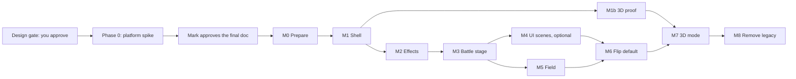

# Shadow Jog Engine — Migration

This file gives the path from today's engine and from the Phaser spike to the new engine. The shipped game still works at every step. The new engine moves in scene by scene.

> **Read first:** [Three things that look like Phaser and are not](README.md#2-three-things-that-look-like-phaser-and-are-not). Tag meanings are in the "Tags" table at the top of [conventions.md](conventions.md).

**Estimates.** Every effort number here is an estimate in working days for one developer paired with agents. It excludes your review time. Each has a confidence label. All of them are low to medium. The field (M5) has the widest error bars.

---

## 1. Principles

1. **No engine code before you approve the design.** This is your gate (decision 17).
2. **Spikes test the approved design.** The platform spike (Phase 0) follows `docs/DEVELOPING.md` section 9: a `spike/<topic>` draft PR that is never merged, with `docs/spikes/<topic>.md` and exit criteria committed before the spike code.
3. **The shipped game still works at every step.** The new engine starts behind a flag: `?engine=sje` in dev, a hidden setting in production. CI stays green on both engines until the default flips.
4. **The old engine is not touched** until M8, except for the `W` and `H` import move in M0.
5. **One branch and one PR per milestone** (repo rule). Each PR adds a `CHANGELOG.md` entry. Names are readable: `engine-m1-shell`.
6. **Build a class only when a ported scene needs it.** The Phaser spike called about 15 display methods. We do not rebuild all of Phaser.
7. **Hybrid by scene.** A scene moves to retained mode only when it needs a camera, a filter, a mask, or a transition. UI scenes may stay on a canvas shell for good (section 4).
8. **Your data is read byte for byte.** `src/data/*.json` never changes in a migration step.

---

## 2. The milestones

"M" means a build milestone. "E" means an open decision ([decisions.md](decisions.md)). "T" means a test tier ([tooling-and-testing.md](tooling-and-testing.md)).

| Milestone | One-line scope | Effort (estimate) | Confidence |
|---|---|---|---|
| **Phase 0** Platform spike | A spike branch that closes the unknowns (section 3) | 7 to 11 days | Low |
| **M0** Prepare | Size module, bundle gate, canary suite, agent docs | 2 to 3 days | Medium |
| **M1** Shell | Loop, renderer, scene stack, `LegacyScene` adapter | 5 to 7 days | Medium |
| **M1b** 3D proof (parallel with M2) | A spinning cube in a `Scene3D`, with the hand-off, leak, and loss tests | 4 days | Medium |
| **M2** Effects | `FxSystem` with the `postfx` facade, composite filter, particles | 5 to 7 days | Low to medium |
| **M3** Battle stage | Port the spike's `src/stage` | 8 to 12 days | Low to medium |
| **M4** UI scenes (optional) | `NineSlice` windows, `ListMenu`, bars, cursor, `TextObject` | 0 to 10 days | Low |
| **M5** Field | The field map, actors, camera, lights, weather | 10 to 14 days | Low |
| **M6** Flip default | `?engine=sje` becomes the default. Remove the old presenter | 4 to 6 days | Medium |
| **M7** 3D mode | `ThreeHost`, `Frame3D`, `Scene3D`, `HackScene`, `s.hack()` | 6 to 8 days | Low |
| **M8** Remove legacy | Delete the old engine files | 3 to 4 days | Medium |

**What "a day" means.** One agent working day, about one or two focused Claude Code sessions. Your review time is extra. These are planning estimates, not measurements.

**Totals (estimates, low confidence).** Phase 0: 7 to 11 days. M0 to M8 without the optional M4: 47 to 65 days. With M4: up to 75 days. M1b runs in parallel with M2, so the calendar time is a little shorter than the sum. The 3D mode (M7) comes after the default flip (M6) in this plan.

### M0 Prepare

- Create `src/sje/core/size.ts`. Replace the uses of 480, 270, 240, and 135 that mean screen width, height, or centre.
- Move the 34 `W` and `H` imports.
- Add a gate on the time between frames and a harness that counts GL objects. Both go into the perf spec.
- Rewrite `bundle-budget.mjs` to read the Vite manifest and sort chunks into classes.
- Pin Pixi and Three. Add the lab page and the canary suite. They test Pixi and Three directly.
- Add the engine skill and `verified-conventions.md`.
- Compile the sketches in [interfaces.md](interfaces.md).
- Copy the lab scripts that the canary suite needs from `media/research-2026-10-04/` into the repo. The lab record is already in `docs/research/2026-10-04-engine-labs.md`.
- Fix doc drift (`?debug` note, chunk count).
- **The game still works:** the old game is unchanged.
- **Exit check:** canaries green on SwiftShader. The bundle gate passes at 233.9 kB gzip.

### M1 Shell

- Build `Game.create`, `FixedLoop`, `GlContext`, `PixiRenderer`, `BackBuffer`, `Presenter`, `Display`, `EventEmitter`, `SceneManager`, `Scene`, and the `LegacyScene` adapter.
- Build the `GameApi` interface. The old `Game` implements it too.
- Add the boot failure message, the hidden-tab clamp, fault isolation, and the DEV hook.
- Add the `fxLevel` setting with the `gpuFx` mapping ([frame-and-rendering.md](frame-and-rendering.md) section 11).
- No effects yet. The old GL presenter is not in this path.
- **The game still works:** the flag gates the new path. Legacy scenes draw into `CanvasImage`s. The 22 `Scene` subclasses and all story scripts run unchanged.
- **Exit check:**
  - Title, field, battle, and shop play under `?engine=sje`.
  - The fault, abandon, curtain, exit-throw, and two render-fault cases of `tests/game.test.ts` pass on the new `Game`.
  - New tests for close order and microtask timing pass.
  - A block test and a screenshot match the old 2D path.
  - The 1,000-object bench is recorded, and the performance budget in [tooling-and-testing.md](tooling-and-testing.md) section 7 gets real numbers.

### M1b 3D proof

- Build a spinning cube in a `Scene3D`, the `GlHandoff` canary, 10 enter and exit cycles, the context-loss watchdog, and the no-WebGL2 result.
- Put a filter and an iris mask on the `View3D`.
- The real hack game waits for M7.
- **The game still works:** lab page and flag only.
- **Exit check:** the leak harness stays flat. The canary is green. A look screenshot goes to you. On the legacy path, `s.hack` returns `unsupported` with reason `no-webgl2`.

### M2 Effects

- Build `FxSystem` with the `postfx` facade: the composite filter port (bloom, 4 shockwaves, color split, 4 hazes, 2 glitches, dim, flash, vignette), `ParticleContainer`, the glow layer, the fx levels, `fxLevel`, and shader warm-up.
- `moments.ts`, `fxdata.ts`, and `fx.json` do not change, because `FxSystem` keeps today's method signatures.
- **The game still works:** the legacy `postfx` facade routes to `FxSystem` under the flag.
- **Exit check:** `playMoment` hits look the same as the old presenter in a side-by-side that you review. Effect specs run at `full` on SwiftShader.

### M3 Battle stage

- Port the spike's `src/stage`. About 3,400 lines call Phaser APIs and about 8,000 do not.
- Build `Figure`, the texture manager (the spike's `textures.ts` is the base), the HUD, the Battle Stage Editor, and Battle Test.
- Wire `battle.ts` to `PlaybackView`. Port the `battle/fx.ts` painters to canvases.
- Measure Pixi parity with the stage.
- M3 reuses the Phaser stage slice that Phase 0 builds (translation layer and parity harness). The estimate assumes this reuse.
- **The game still works:** the battle plays on the new stage under the flag.
- **Exit check:** the editor and Battle Test pass. A scripted Battle Test (seed 7) gives an identical status trace. Pixel parity is within a tolerance that you agree.

### M4 UI scenes (optional)

- Build `NineSlice` windows, `ListMenu`, bars, cursor, and `TextObject`.
- The scenes: title, menu, options, dialog, shop, panels, deck, saveload, card, controls, ending, gameover. They hold about 270 `drawText` and 57 `drawWindow` call sites.
- **The game still works:** a scene ports only when it needs a camera, filter, mask, or transition. The rest stay on `CanvasImage`.
- **Exit check:** each ported scene's e2e spec passes.

### M5 Field

- Build the field map as 4 baked `ImageObject` layers (largest 960x672).
- Build actors with `ySort`, the camera with pan easing and bounds, `Lights`, per-frame prop animations and water shimmer as `CanvasImage` painters, and weather.
- **The game still works:** the field stays on the legacy shell until this milestone lands.
- **Exit check:** walking, warps, scripts, emote, and followers play. The playthrough spec is green. **You approve the lighting.**

### M6 Flip default

- Make `?engine=sje` the default. Remove `GlPresenter` and the `#fx` path.
- Port the FX lab. Rewrite specs that used `#fx`.
- Re-baseline the perf gates on CI. Set the bundle caps. Add goldens.
- **The game still works:** the old path stays one release in git history. It is not shipped. Players without WebGL 2 see the message from E5.
- **Exit check:** full CI is green on SwiftShader. Playthrough, chaos, perf, prod, and gameover pass.

### M7 3D mode

- Build `ThreeHost`, `Frame3D` (shared context and fallback), `Scene3D`, `HackScene`, `s.hack()`, `HackResult`, the sim module and its tests, the lifecycle and leak tests, and the transition.
- Hold the look review with you.
- **The game still works:** only story scripts that call `s.hack` are new.
- **Exit check:** the 10-cycle leak test, the context-loss test, and the canary tests pass. After the flip, `unsupported` shows only when the 3D chunk fails to load.

### M8 Remove legacy

- Delete `src/engine/{game,display,postfx,gl}`, `LegacyScene`, and the shim events.
- Update `ARCHITECTURE.md` and `DEVELOPING.md`.
- **Exit check:** `tsc`, Biome, and all specs are green.

**Total.** M0 to M8 without Phase 0 and without M4: about 47 to 65 working days (low confidence). Phase 0 adds 7 to 11. M4 adds up to 10. M1b runs in parallel but its effort still counts.

**Why this order.**

- M1 first shows, early and cheaply, that Pixi runs the whole game under SwiftShader CI, and that input, audio, saves, and the story bridge are untouched.
- M2 before scene ports, because effects are "the real differentiator" and carry the most Pixi-specific risk.
- M1b right after M1, because the shared context is the riskiest join. It should be retired before many scenes depend on it.
- M3 is the first real port because the spike's seam is narrow and its tests exist.
- M5 is the largest and least certain port. The spike never touched the field.

---

## 3. Phase 0: the platform spike

Phase 0 is the spike from `docs/research/2026-10-04-engine-and-3d.md` ("Open items", item 2). It runs on a spike branch before any build. It has two parts.

**Part A: the verification lab (2 to 3 days).** It closes the unknowns that decide the design. It runs the agent-lab experiments again on the CI browser:

- Chromium 153 (the version CI will install, not 151).
- Firefox and WebKit WebGL 2 on the `ubuntu-latest` runner.
- A sprite (alpha) mask and a custom GLSL filter on the `View3D`.
- A mask or filter on a container with sorted children.
- Device pixel ratio 1.5 for filters and blocks.
- `RenderLayer` with filters.
- `roundPixels` with a negative scale (the mirror rule).
- The Pixi-first, Three-later attach order on a real GPU and in Firefox. (A SwiftShader lab already ran it.)

**Part B: the three spike builds (about 5 to 8 days, low confidence).** These are the parts you named:

1. The battle stage on a thin Pixi layer (the spike code with the translation table in section 6). **The Phase 0 slice:** one stage, one hero, one enemy, the HUD off, and parity checked on 3 frames. Estimate: 2 to 3 days (low confidence). M3 reuses its translation layer and parity harness, then adds all stages, the HUD, the editor, and Battle Test.
2. A 3D hacking scene that a story script starts.
3. The 480x270 against 640x360 mock.

**The pass lines.** These come from your feedback on 2026-10-04.

| # | Pass line | Where it is tested |
|---|---|---|
| 1 | Bundle growth is measured. The alarm is re-set on purpose. The 3D chunk size is recorded. Lazy chunks get their own class. | Phase 0 Part B. Caps are set in M1 and M6. |
| 2 | 60 fps with bloom on your desktop. Mobile is not a requirement. | Phase 0 Part B, T3. |
| 3 | CI passes on software WebGL. | Phase 0 CI run. |
| 4 | After a context loss, or with no WebGL2, the 3D mode gives a fallback result within 2 seconds. | Phase 0 3D scene. Re-run in M1b and M7. |
| 5 | Enter and leave the 3D mode ten times. Memory does not grow. | Phase 0 3D scene. Re-run in M1b and M7. |
| 6 | A per-object Pixi filter and a mask work on the shared context with Three. | Phase 0 Part A. Re-run in M1b. |
| 7 | The battle stage on Pixi matches the Phaser spike within the agreed tolerance. | Phase 0 Part B. Full parity in M3. |
| 8 | You approve the look. Plan at least two review rounds, with no maximum. | Phase 0, M2, M5, M7. |

Phase 0 ends with an update to this design doc and your approval of the final version.

---

## 4. Moving scenes in: the LegacyScene adapter

A legacy scene is one that has `enter`, `exit`, `resume`, `update()`, and `render(ctx)`. It runs inside `LegacyScene`, a `Scene` subclass.

| Legacy | In `LegacyScene` |
|---|---|
| `enter()` | `create()` |
| `exit()` | `shutdown` event |
| `resume()` | `resume` event |
| `update()` | `fixedUpdate(tick)` |
| `render(ctx)` | Called in `prerender` into the scene's own `CanvasImage` |
| `opaque`, `curtain`, `passUpdate`, `close(result)` | Unchanged. The curtain rule is the same as today ([scene-graph.md](scene-graph.md) section 6). |

- The shell draws today's Canvas 2D frame into one `CanvasImage` (world) and a second (UI layer). `texture.source.update()` uploads it each frame. A 480x270 frame was pixel-exact in the lab (0 of 129,600 pixels differ).
- The stack, the story scripts, and `ScriptApi` do not change. They type against `GameApi`.
- `create()` is synchronous. A lazy chunk loads before the scene is built (frame-and-rendering.md section 2).
- Two lifecycles exist side by side until M8. The adapter hides this. The docs say so.

**Hybrid rule.** A legacy scene stays on `LegacyScene` as long as it needs no camera, filter, mask, or transition. Title, menu, dialog, shop, options, deck, and saveload are in this group. Port a scene when it needs one of those. M4 is demand-driven. This removes the biggest low-value rewrite (about 270 `drawText` and 57 `drawWindow` call sites) from the critical path.

**What is the same when UI stays on canvas.** The new engine still owns the loop, the stack, the effects, and the 3D mode. The scene draws as one texture, so stage effects can act on it as on any sprite.

---

## 5. From today's engine

| Today | New home | Step |
|---|---|---|
| `src/engine/game.ts` (`W`, `H`, `FPS`) | `src/sje/core/size.ts` | M0 |
| `src/engine/game.ts` (`Game`, `Scene`) | `src/sje/runtime/` | M1 |
| `src/main.ts` loop | `FixedLoop` | M1 |
| `src/engine/display.ts` | `Display` | M1 |
| `src/engine/input.ts` | `ActionMap`, `InputManager` | M1 |
| `src/engine/rng.ts`, `assert.ts` | `src/sje/core/` | M1 |
| `src/engine/postfx.ts`, `gl/presenter.ts`, `moments.ts` | `FxSystem`, `CompositeFilter` | M2 |
| `src/engine/font.ts`, `canvas.ts`, `ui/draw.ts` | Stay. `TextObject` and painters call them. | M4 |
| `src/art/*` painters | Stay. Output canvases become textures. | M3 to M5 |
| `src/audio/*` | Unchanged. `game.audio` wraps it. | M1 |
| `src/game/*` (state, save, settings, script) | Unchanged in shape. `gpuFx` becomes `fxLevel` with a `backfill()` mapping. `ScriptApi` gains `hack()`. | M1 and M7 |
| `src/battle/{engine,ai,setup,types}.ts` | Unchanged. | none |
| `src/battle/fx.ts` | Renderer code. Moves to the display code. | M3 |
| `src/dev/fxlab.ts` | Port. | M6 |
| `src/engine/*` after M6 | Deleted. | M8 |

**Roughly 60% of the raw canvas calls are bake-time painters** (props, backdrops, enemies, buildings). They output canvases and become textures unchanged. The code that must change is the per-frame scene, UI, lighting, and effect drawing: about 600 raw calls, plus the `drawText` and `drawWindow` sites that M4 handles on demand. Part of the field's animated look (about 10 prop animation closures, water shimmer, weather) draws every frame. It needs a `CanvasImage` path, not a bake.

---

## 6. From the Phaser spike

The spike is a thin layer over Phaser. Only 9 of its 57 files in `src/stage` import `phaser`. About 3,400 lines call renderer APIs. About 2,800 depend on the scene shape. About 8,000 use neither and port as they are. The Battle Stage Editor never touches a Phaser object.

### Translation table

| Spike | New engine |
|---|---|
| `import Phaser from 'phaser'` | `import { ... } from '@/sje'` |
| `new Phaser.Game(config)`, `boot.ts` Scale NONE and CSS zoom | `await Game.create(config)`, `Display` |
| `add.image`, `add.sprite`, `add.container`, `add.graphics` | Same names. `ImageObject` is the class for `image`. |
| `setOrigin`, `setDepth`, `setFlipX`, `setScrollFactor(0)`, `setTexture(key, frame)` | Same names, same semantics. The wrapper handles anchor, flip, and routing. |
| `cameras.main.setScroll` | Same |
| `textures.exists`, `get`, `addCanvas`, `remove`, `getTextureKeys`, `getPixelAlpha` | Same on `TextureManager`. `customData` is `data`. |
| `load.spritesheet`, `FILE_LOAD_ERROR` | `load.spritesheet`, `loaderror`, and stand-ins |
| `Phaser.Scale.Events.RESIZE` | `game.scale.on('resize')` |
| `PRE_STEP`, `POST_RENDER` | `prestep`, `postrender` |
| `StageScene.update(_t, delta)` with its own accumulator | `fixedUpdate(tick)`. Delete the duplicate accumulator. |
| `setData`, `getData` (2 sites) | Same. The wrapper has them. |
| `setInteractive` with `hitAreaCallback` (the lab's edit mode) | `Zone` and `scene.pick` |
| `labhook.ts` | `__SJ__` additions |

### Changes that are not mechanical

1. **Mirror.** Phaser flips about the texture middle. Pixi flips about the anchor. The wrapper uses `anchor.x = 1 - originX` and `scale.x = -abs(scaleX)`. The spike's `mirrorFigure` maths stays. The rule with `roundPixels` is not tested (Phase 0 Part A).
2. **Figures.** Today `perform.ts` and `battletest.ts` reach into `f.home`. The port adds a `Figure` class so only that class touches nodes.
3. **Parity.** The parity bench ran the unchanged stage on a Canvas 2D display list, not on Pixi. Pixi alpha handling in translucent HUD panels may differ.
4. **Texture identity.** The spike compares `${texture.key}|${frame}` strings and prunes by key prefix. The `TextureManager` keeps stable string keys and per-key frame tables, including copied frames in `variantOf`.
5. **e2e.** About 47 lines in the spike's specs read Phaser properties. They move to `Figure` accessors.

### Data

The design JSON on the spike branch (`stages`, `heroes`, `hud`, `axes`, `enemyfacing`, `moves`) is read byte for byte. `fx.json` on this branch and on the spike are identical. Tests follow the "fixtures versus shipped data" rule in `DEVELOPING.md` section 3. Whether `moves.json` is yours is E24.

### What happens to the spike

Its checkout stays as a visual reference until M3 parity is accepted. Then you decide about the `archive/*` tag (not before). PR #3 and PR #4 never merge.

---

## 7. Rollback

- Every milestone is a branch and a PR. A bad milestone is reverted by reverting its merge.
- The flag keeps the old path until M6.
- After M6 the old path stays one release in git history. M8 deletes it.
- If Phase 0 fails a pass line, the design doc changes before any build. The fallbacks are in the table: canvas-copy for 3D, a different effects home, or a hybrid with the legacy engine kept longer.

---

## 8. What can break the estimate

- **The field (M5).** The lighting model has no one-to-one form on Pixi. About 10 prop animations, water, and weather draw per frame. Estimate: low confidence.
- **Effects parity (M2).** A single composite filter is not built. Its look and cost can drift from `fx.json`.
- **CI behaviour.** Every spec now runs on software WebGL. Run time and flakiness can rise. Chromium 153 differs from the lab's 151.
- **Pixi and Three upgrades.** Pixi releases a minor every 2 to 6 weeks. The fixes use internals. Pin and bump on purpose, with the canary suite.
- **Retained-mode surprises.** The typewriter text, the per-frame canvas uploads, and nested scaled containers in the battle are not benchmarked.
- **Firefox and WebKit.** The shared-context path is unproven there.
