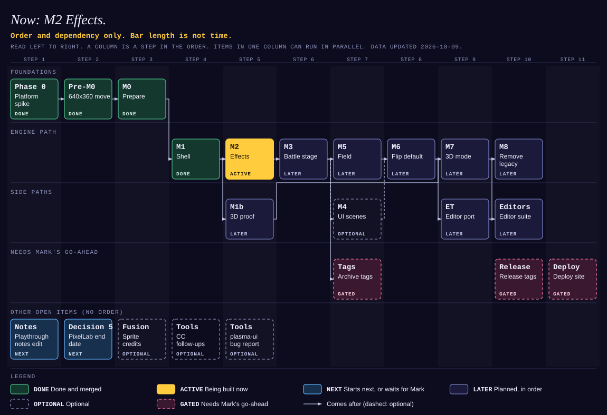

<!-- Generated by scripts/gen-roadmap.mjs from docs/roadmap/roadmap.json. Do not edit by hand. Run `npm run roadmap`. -->

# Shadow Jog roadmap

Now: M0 Prepare. Next: M1 Shell.

**Order and dependency only. Bar length is not time.** Mark wants no hour or day estimates. A column is a step in the order. Items in the same column can run in parallel.

*Source: [roadmap.json](roadmap.json). The chart is [roadmap.svg](roadmap.svg).*

## The same data as a table

| Item | Lane | Step | Status | Comes after | Where | Notes |
|---|---|---|---|---|---|---|
| Phase 0 Platform spike | Foundations | 1 | done | none | PR #11 (draft, never merged) | Mark approved the final engine design on 2026-10-05. Record: docs/spikes/engine-platform.md. |
| Pre-M0 640x360 move | Foundations | 2 | done | Phase 0 | branch `resolution-640x360`, PR #23 (merged 2026-10-09) | The shipped game plays at 640x360. Record: docs/PIVOT-640.md. |
| M0 Prepare | Foundations | 3 | active | Pre-M0 | branch `engine-m0-prepare` | Size module, bundle gate, canary suite, agent docs. Worktree: projects/shadow-jog-engine. |
| M1 Shell | Engine path | 4 | next | M0 | none | Loop, renderer, scene stack, LegacyScene adapter. Behind the ?engine=sje flag. |
| M2 Effects | Engine path | 5 | later | M1 | none | FxSystem with the postfx facade, composite filter, particles. |
| M3 Battle stage | Engine path | 6 | later | M2 | none | The side-battle rebuild lands here. Spike PRs #3 (side-battle) and #4 (phaser-stage) stay open as references and never merge. |
| M5 Field | Engine path | 7 | later | M3 | none | Field map, actors, camera, lights, weather. Mark approves the lighting. |
| M6 Flip default | Engine path | 8 | later | M5, M4 | none | ?engine=sje becomes the default. The old presenter goes. M4 joins here if it is built. It is optional (dashed arrow). |
| M7 3D mode | Engine path | 9 | later | M6, M1b | none | Needs both the 3D proof (M1b) and the default flip (M6). |
| M8 Remove legacy | Engine path | 10 | later | M7 | none | Delete the old engine files. |
| M1b 3D proof | Side paths | 5 | later | M1 | none | Parallel with M2. A spinning cube in a Scene3D, with the hand-off, leak and loss tests. |
| M4 UI scenes | Side paths | 7 | optional | M3 | none | Optional. A UI scene ports only when it needs a camera, a filter, a mask or a transition. |
| archive-tags Archive tags | Needs Mark's go-ahead | 7 | gated | M3 | none | archive/side-battle-<date> and archive/phaser-stage-<date>, then close PRs #3 and #4. Mark approves each tag. They wait until M3 lands (status.md, Next for agents 3). |
| release-tags Release tags | Needs Mark's go-ahead | 10 | gated | none | none | Annotated v* tags. Cut only after Mark's playtest and go-ahead. Not tied to one milestone. The column is only a place on the chart. |
| deploy Deploy site | Needs Mark's go-ahead | 11 | gated | none | none | Site: shadowjog.com. The last alpha step, with the secure email sign-up. Only with Mark's explicit go-ahead. Not tied to one milestone. The column is only a place on the chart. |
| playthrough-notes Playthrough notes edit | Other open items (no order) | 1 | next | none | none | Mark's uncommitted edit to docs/mark-playthrough-notes.md waits for him. |
| pixellab-end PixelLab end date | Other open items (no order) | 2 | next | none | none | Decision 5 in docs/PHASE-0.2.md is open. The PixelLab plan ends about 2026-10-30. |
| sprite-fusion Sprite credits | Other open items (no order) | 3 | optional | none | none | Sprite Fusion. Mark spends the next credits on the shopping list when he is ready. |
| cc-followups CC follow-ups | Other open items (no order) | 4 | optional | none | none | Command Center items left over (status.md, Next for agents 1b). All optional. |
| plasma-bug plasma-ui bug report | Other open items (no order) | 5 | optional | none | none | An upstream bug report for the plasma-ui canvas width (R28), if Mark wants one. |

Statuses: **done** (done and merged), **active** (being built now), **next** (starts next, or waits for mark), **later** (planned, in order), **optional** (optional), **gated** (needs mark's go-ahead).

## How to update

1. Edit `docs/roadmap/roadmap.json`. It is the only source. Never edit `roadmap.svg` or this file by hand.
2. Run `npm run roadmap`. It rewrites `roadmap.svg` and this file.
3. Run `npm run check`. The test `tests/roadmap.test.ts` fails when the generated files are out of date.

Do this in every status update. A milestone item uses the same id as its row in the table of `docs/engine/migration.md` section 2 (`M0`, `M1b`, `Pre-M0`). The `milestone:` key in the frontmatter of `status.md` must name the milestone item whose status is `active`. The value `none` means no item is active. `Pre-M0` may also be `done`.

Item fields:

| Field | Meaning |
|---|---|
| `id` | A unique name. A milestone uses its id from `migration.md`. |
| `kind` | `milestone` for a row of that table. Leave it out for anything else. |
| `label` | The name on the bar: two lines of 12 characters at most. |
| `tag` | Optional. The short first line on the bar. The default is the id. 10 characters at most. |
| `lane` | The id of a lane in `lanes`. |
| `status` | One of `done`, `active`, `next`, `later`, `optional`, `gated`. |
| `after` | The ids this item waits for. It sets the column: one after the latest one. A list can be empty. |
| `column` | Optional. Puts the item in a later column than its dependencies need. Counts from 0. |
| `branch`, `pr` | Optional. Where the work is. |
| `notes` | One or two short sentences. |
